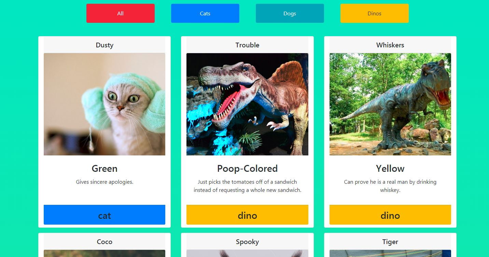

# Adoption-Website

## Technologies Used:

    * HTML5 
    * CSS 
    * JavaScript 

## Description 

This is a one page application with cards of pet's image and information about the pets. You will see three buttons were you can filter the pets or "all" button were it will show all of them.

## Screenshots

## Contributor

    * Feven Mulugeta

## Instructions 

1. Go to: `https://www.npmjs.com/package/http-server` and install "http-server".  
2. Navigate to the project folder in command line interface and type: `http-server -p 8080`  
3. This will show at: `http://localhost:8080` in your internet browser. 
